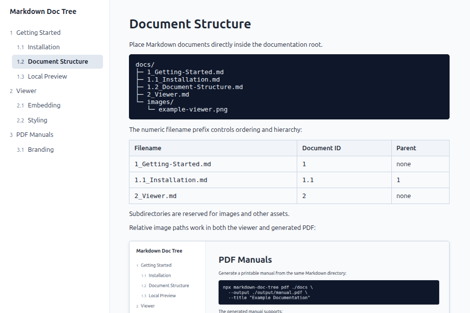

# Viewer

The viewer renders the generated document tree and loads Markdown documents on demand.

It supports:

- internal component navigation
- URL-hash navigation
- configurable initial documents
- relative links and images
- consumer-defined styling

The viewer is framework-independent and can be used wherever Web Components are supported.
